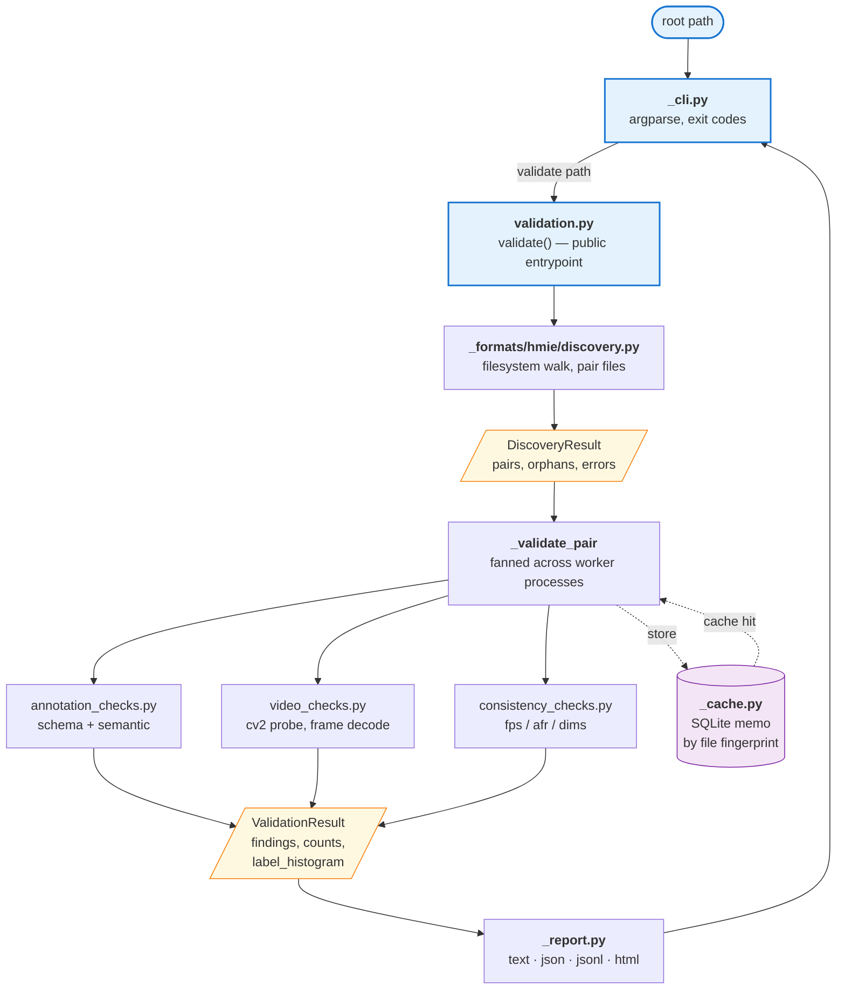
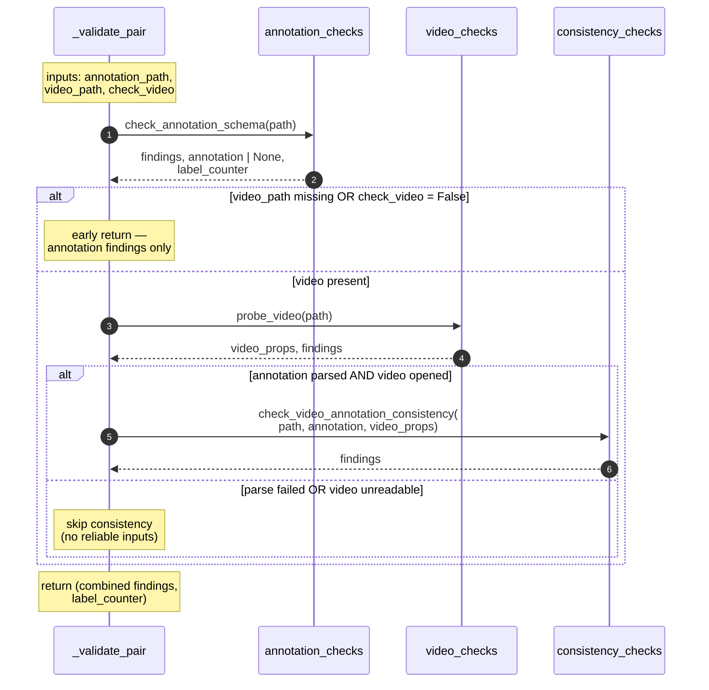

# Architecture

A reviewer's map of the codebase. Read this with the code open.

## What databridge does (today)

One pipeline: **walk a dataset root on disk → pair each annotation JSON
with its video → run checks on each pair → aggregate findings into a
`ValidationResult` → render a report**. The only format currently
implemented is HMIE (Scale Video Playback JSON + snippet folder layout).
Everything is structured so other formats can be added behind the same
public entrypoint without touching the CLI or reporting layers.

## Project layout

```
src/databridge/
    __init__.py              Public API surface
    _cli.py                  CLI entrypoint (`databridge validate ...`)
    _types.py                Shared types: Finding, Severity, ValidationResult
    _cache.py                On-disk cache for expensive video probes
    _report.py               Text / JSON / JSONL / HTML report rendering
    _version.py              Package version
    validation.py            Orchestration: discovery -> checks -> aggregation
    _formats/
        __init__.py          Format registry
        hmie/
            __init__.py              HMIE format entrypoint
            discovery.py             Filesystem walk (snippet-centric, seq_mp4 / seq_ts)
            schema.py                Pydantic models for Scale Video Playback JSON
            categories.py            Severity / category taxonomy for findings
            annotation_checks.py     Scale schema + semantic checks on JSONs
            video_checks.py          FMV open / decode / corruption checks
            consistency_checks.py    Annotation <-> video cross-references
docs/
    architecture.md                              This file
    schemas/
        scale-video-playback-v1.schema.json      JSON Schema for Scale format
tests/                       pytest suite (coverage gate 90%)
```

For the on-disk dataset layout that `discovery.py` walks, see the
["Dataset layout on disk" section in the README](../README.md#dataset-layout-on-disk).

## Reading order

The modules form a clean dependency stack. Read them bottom-up; each
layer depends only on layers below it.

1. `_types.py` — the vocabulary (`Finding`, `Severity`, `ValidationResult`, `DatasetFormat`)
2. `_formats/hmie/schema.py` — Pydantic models for the Scale annotation JSON
3. `_formats/hmie/discovery.py` — filesystem walk that produces `SnippetPair`s
4. `_formats/hmie/annotation_checks.py` — per-annotation checks (schema + semantic)
5. `_formats/hmie/video_checks.py` — per-video integrity probe (cv2)
6. `_formats/hmie/consistency_checks.py` — cross-checks between annotation and video
7. `_formats/hmie/categories.py` — maps check names to the 4 requirement categories
8. `_cache.py` — SQLite-backed memo of per-pair results keyed by file fingerprint
9. `validation.py` — orchestration: discovery + fan-out to workers + aggregation
10. `_report.py` — text / JSON / JSONL / HTML rendering of a `ValidationResult`
11. `_cli.py` — argparse wrapper around `validate()` and the renderers

## Data flow CLI



## Data flow notebook

Skipping the CLI — a notebook or script imports `validate` directly,
gets a `ValidationResult` back, and either inspects it in code
(pandas, custom analysis) or passes it to `_report.py` for a rendered
view inside a cell.


## Discovery — how pairs are built

`discovery.py` runs in two phases: a single `os.walk` that *classifies*
every directory it meets (snippet? seq_*? annotation parent? metadata
to skip?), then a pairing pass that matches annotations to videos via
their shared snippet directory. The layout varies between dataset
families (`scale/` vs a labeler subfolder, `seq_mp4/` vs `seq_ts/`,
`mapp_metadata/` vs `0601_metadata/`), so every decision below is a
branch in the real code.


Key invariants worth remembering while reading `discovery.py`:

- A "snippet dir" is defined by the *presence of a `seq_*/` child*, not
  by name — this is what makes the walker tolerate the family-specific
  layout differences.
- Snippet-level JSONs (right next to `seq_mp4/`) are never annotations —
  they are video metadata. Annotations always live one level deeper, in
  a subdirectory like `scale/` or a labeler folder. The `parent.parent`
  indexing in Phase 2 relies on this.
- A snippet with videos but no annotation subdir is *not* an error here
  — it just produces no pairs. Whether that's acceptable for the
  dataset is a decision made later, in `validation.py`'s coverage check.


## Inside one pair's validation

The top-level diagrams hide the guards inside `_validate_pair`. This
sequence shows what actually happens for a single `(annotation, video)`
pair — note the early exits and the fact that the parsed annotation
is *reused* (not re-parsed) by the consistency check.



The consistency step runs even if `video_checks` emitted ERROR findings
(e.g. a bad middle frame), as long as `video_props.opened` is true —
fps / frame_count / dimensions are still authoritative in that case,
and gating would silently hide real annotation-vs-video mismatches.
