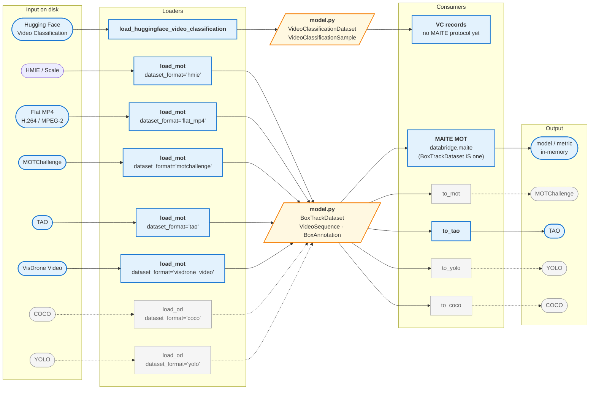
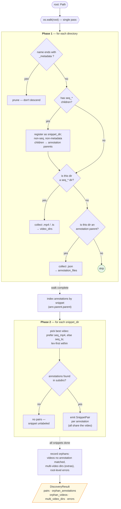
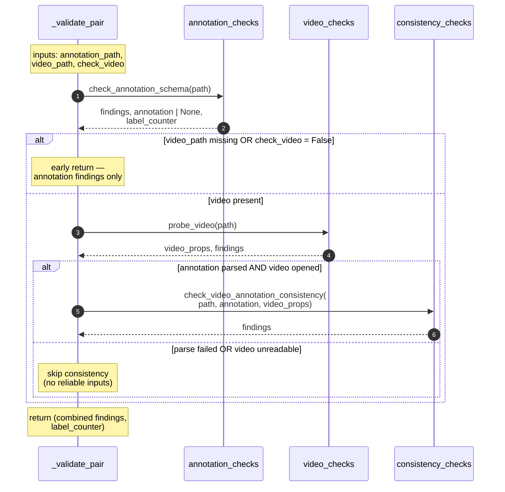
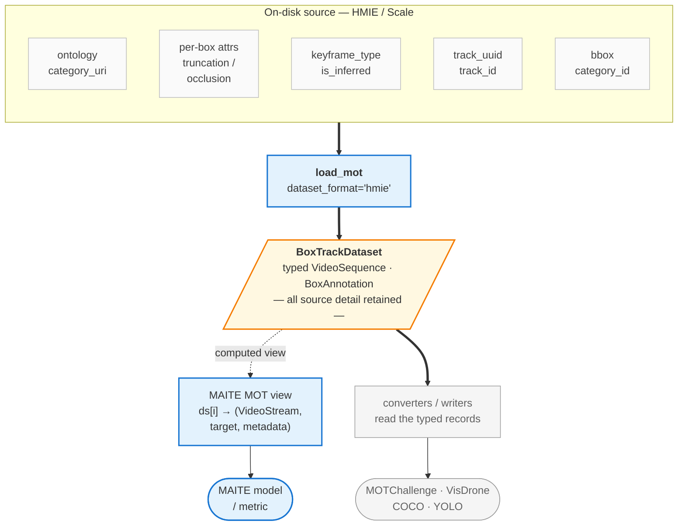
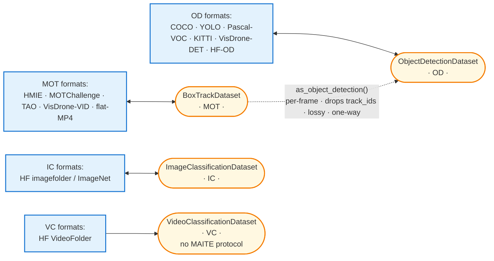

# Architecture

A reviewer's map of the codebase. Read this with the code open.

## What databridge does (today)

One validation pipeline: **walk a dataset root on disk → pair each annotation
JSON with its video → run checks on each pair → aggregate findings into a
`ValidationResult` → render a report**. The only validation format currently
implemented is HMIE (Scale Video Playback JSON + snippet folder layout). On
the loading side, flat-folder MP4 video, Hugging Face Video Classification,
MOTChallenge, TAO, and VisDrone Video are also implemented loaders. Everything
is structured so other formats can be added behind the same public entrypoint
without touching the CLI or reporting
layers.

## The bridge — loaders × consumers

The longer-term shape is an **N-to-M bridge**. A *loader* parses an
on-disk dataset into a task-appropriate in-memory model. For today's MOT / video
box-track formats, that model is `model.py`'s `BoxTrackDataset`: it is consumed
**directly as a MAITE multi-object-tracking dataset** and by *converters /
writers* that serialise it back out to another on-disk format. Hugging Face
Video Classification is intentionally separate: it returns
`VideoClassificationDataset` source records because MAITE 0.9.5 has no video
classification protocol, so it does not masquerade as the MOT surface. Solid =
implemented today; dashed = planned.



Today, the MOT loaders (HMIE, flat MP4, MOTChallenge, TAO, VisDrone Video) are
all reached through the task-first `load_mot(dataset_format=…)` entry point; the
Hugging Face Video Classification loader (`load_huggingface_video_classification`),
the HMIE validation pipeline, the HMIE and TAO writers, and the MAITE surface
(`databridge.maite`) are implemented. Hugging Face Video Classification returns
its own `VideoClassificationDataset` records and has no MAITE surface yet. See
[Loading](#loading--hmie-loader) for how MOT loaders build the box-track model,
[The model as a MAITE dataset](#the-model-as-a-maite-dataset) for the MAITE
surface, and [Writer architecture](#writer-architecture--writerspy) for the
writer contract.

## Project layout

```
src/databridge/
    __init__.py              Public API surface
    _cli.py                  CLI entrypoint (`databridge validate ...`)
    _types.py                Shared types: Finding, Severity, ValidationResult, DatasetFormat, Task
    _cache.py                On-disk cache for expensive video probes
    _report.py               Text / JSON / JSONL / HTML report rendering
    _version.py              Package version
    model.py                 Neutral models: BoxTrackDataset/VideoSequence/BoxAnnotation + VC records
    geometry.py              Canonical absolute-pixel xywh bbox + conversions (xyxy / cxcywh / normalized / YOLO)
    taxonomy.py              Source-preserving category table: Taxonomy, CategoryEntry (will replace dict[str,int])
    loaders.py               Loader contract (ABC) + registry + load() dispatch
    writers.py               Writer contract (ABC) + registry + write() dispatch
    validation.py            Orchestration: discovery -> checks -> aggregation
    conversion.py            convert(): end-to-end load + write (on-disk -> on-disk)
    maite/                   Optional MAITE surface (databridge[maite] extra)
        __init__.py              package doc; the model is MAITE directly (no adapter)
        _mot.py                  build_mot_item: the MOT view computed from the model
        _decode.py               Decoder protocol + PyAV backend (lazy)
        _common.py               numpy-array + datum-metadata helpers
    _formats/
        __init__.py          Format package namespace
        flat_mp4/
            __init__.py              Flat MP4 format exports
            loader.py                FlatMp4Loader: flat .mp4 video folder -> BoxTrackDataset
        hmie/
            __init__.py              HMIE format entrypoint
            loader.py                HmieLoader: on-disk HMIE -> BoxTrackDataset
            discovery.py             Filesystem walk (snippet-centric, seq_mp4 / seq_ts)
            schema.py                Pydantic models for Scale Video Playback JSON
            categories.py            Severity / category taxonomy for findings
            annotation_checks.py     Scale schema + semantic checks on JSONs
            video_checks.py          FMV open / decode / corruption checks
            consistency_checks.py    Annotation <-> video cross-references
            writer.py                HmieWriter: reference writer (BoxTrackDataset -> on-disk HMIE)
        huggingface_video_classification/
            __init__.py              Hugging Face Video Classification exports
            loader.py                HuggingFaceVideoClassificationLoader: VideoFolder -> VideoClassificationDataset
        motchallenge/
            __init__.py              MOTChallenge format exports
            loader.py                MotChallengeLoader: standard MOTChallenge -> BoxTrackDataset
        tao/
            __init__.py              TAO format exports
            loader.py                TaoLoader: official TAO JSON -> BoxTrackDataset
            writer.py                TaoWriter: BoxTrackDataset -> official TAO root
        visdrone/
            __init__.py              VisDrone format exports
            loader.py                VisDroneVideoLoader: VisDrone VID/MOT video -> BoxTrackDataset
docs/
    architecture.md                              This file
    schemas/
        scale-video-playback-v1.schema.json      JSON Schema for Scale format
tests/                       pytest suite (coverage gate 90%)
```

For the on-disk dataset layout that `discovery.py` walks, see the
["Dataset layout on disk" section in the README](../README.md#dataset-layout-on-disk).

## Reading order

The modules form a clean dependency stack. Read them bottom-up; each
layer depends only on layers below it.

1. `_types.py` — the vocabulary (`Finding`, `Severity`, `ValidationResult`, `DatasetFormat`)
2. `_formats/hmie/schema.py` — Pydantic models for the Scale annotation JSON
3. `_formats/hmie/discovery.py` — filesystem walk that produces `SnippetPair`s
4. `_formats/hmie/annotation_checks.py` — per-annotation checks (schema + semantic)
5. `_formats/hmie/video_checks.py` — per-video integrity probe (cv2)
6. `_formats/hmie/consistency_checks.py` — cross-checks between annotation and video
7. `_formats/hmie/categories.py` — maps check names to the 4 requirement categories
8. `_cache.py` — SQLite-backed memo of per-pair results keyed by file fingerprint
9. `validation.py` — orchestration: discovery + fan-out to workers + aggregation
10. `_report.py` — text / JSON / JSONL / HTML rendering of a `ValidationResult`
11. `_cli.py` — argparse wrapper around `validate()` and the renderers

## Data flow CLI


## Data flow notebook

Skipping the CLI — a notebook or script imports `validate` directly,
gets a `ValidationResult` back, and either inspects it in code
(pandas, custom analysis) or passes it to `_report.py` for a rendered
view inside a cell.


## Discovery — how pairs are built

`discovery.py` runs in two phases: a single `os.walk` that *classifies*
every directory it meets (snippet? seq_*? annotation parent? metadata
to skip?), then a pairing pass that matches annotations to videos via
their shared snippet directory. The layout varies between dataset
families (`scale/` vs a labeler subfolder, `seq_mp4/` vs `seq_ts/`,
`mapp_metadata/` vs `0601_metadata/`), so every decision below is a
branch in the real code.



Key invariants worth remembering while reading `discovery.py`:

- A "snippet dir" is defined by the *presence of a `seq_*/` child*, not
  by name — this is what makes the walker tolerate the family-specific
  layout differences.
- Snippet-level JSONs (right next to `seq_mp4/`) are never annotations —
  they are video metadata. Annotations always live one level deeper, in
  a subdirectory like `scale/` or a labeler folder. The `parent.parent`
  indexing in Phase 2 relies on this.
- A snippet with videos but no annotation subdir is *not* an error here
  — it just produces no pairs. Whether that's acceptable for the
  dataset is a decision made later, in `validation.py`'s coverage check.
- **Batch-level `scale/` merges with the snippet-centric pass** (it is not
  an all-or-nothing fallback). Any `scale/` directory that is *not* inside a
  snippet — i.e. a batch-level `scale/` holding annotations for sibling
  snippets — is discovered per batch directory and its pairs are *added* to
  the per-snippet pairs. So a parent of several batches each with their own
  `scale/`, and trees that mix per-snippet and batch-level annotations, are
  both fully discovered. Each annotation is paired to a video *within its
  batch* by the filename embedded in the Scale annotation name
  (`match_annotation_to_video`, also reused by the loader's override mode);
  that matcher returns ambiguous (orphan) rather than guessing when two
  videos share a basename, and non-annotation JSON (e.g. `metadata.json`) in
  a `scale/` dir is skipped. Batch-level pairs carry the matched video's
  `snippet_dir` so `validation.py`'s `snippet_count` stays correct.


## Inside one pair's validation

The top-level diagrams hide the guards inside `_validate_pair`. This
sequence shows what actually happens for a single `(annotation, video)`
pair — note the early exits and the fact that the parsed annotation
is *reused* (not re-parsed) by the consistency check.



The consistency step runs even if `video_checks` emitted ERROR findings
(e.g. a bad middle frame), as long as `video_props.opened` is true —
fps / frame_count / dimensions are still authoritative in that case,
and gating would silently hide real annotation-vs-video mismatches.

## Loader architecture — `loaders.py`

The input side of the bridge is a small, explicit contract so that every
format loader looks the same and a new format is additive. Three pieces:

```mermaid
flowchart TD
    LOAD["<b>load(root, dataset_format=…)</b><br/>public dispatch"]
    REG[("<b>registry</b><br/>DatasetFormat → Loader")]
    BASE["<b>Loader (ABC)</b><br/>load(root, **options) → VisionDataset<br/>sniff(root) → bool"]
    HMIE["<b>HmieLoader</b><br/>(_formats/hmie/loader.py)"]
    FLAT["<b>FlatMp4Loader</b><br/>(_formats/flat_mp4/loader.py)"]
    HF["<b>HuggingFaceVideoClassificationLoader</b><br/>(_formats/huggingface_video_classification/loader.py)"]
    MOT["<b>MotChallengeLoader</b><br/>(_formats/motchallenge/loader.py)"]
    TAO["<b>TaoLoader</b><br/>(_formats/tao/loader.py)"]
    VIS["<b>VisDroneVideoLoader</b><br/>(_formats/visdrone/loader.py)"]
    NEW["CocoLoader, YoloLoader, …<br/>(future)"]

    LOAD -->|get_loader| REG
    REG --> HMIE
    REG --> FLAT
    REG --> HF
    REG --> MOT
    REG --> TAO
    REG --> VIS
    REG -.-> NEW
    HMIE -->|subclasses| BASE
    FLAT -->|subclasses| BASE
    HF -->|subclasses| BASE
    MOT -->|subclasses| BASE
    TAO -->|subclasses| BASE
    VIS -->|subclasses| BASE
    NEW -.->|subclasses| BASE
    HMIE -->|@register_loader| REG
    FLAT -->|@register_loader| REG
    HF -->|@register_loader| REG
    MOT -->|@register_loader| REG
    TAO -->|@register_loader| REG
    VIS -->|@register_loader| REG
    NEW -.->|@register_loader| REG

    classDef entry fill:#e3f2fd,stroke:#1976d2,stroke-width:2px;
    classDef store fill:#f3e5f5,stroke:#7b1fa2;
    classDef impl fill:#e8f5e9,stroke:#2e7d32;
    classDef planned fill:#f5f5f5,stroke:#9e9e9e,color:#616161;
    class LOAD entry;
    class REG store;
    class HMIE,FLAT,HF,MOT,TAO,VIS impl;
    class NEW planned;
```

- **`Loader` (ABC).** The contract: a concrete loader sets a `format`
  (`DatasetFormat`) class attribute and implements
  `load(self, root, **options) -> VisionDataset` (a task-appropriate model;
  today `BoxTrackDataset` for MOT or `VideoClassificationDataset` for VC). An
  optional `sniff(root) -> bool` classmethod is the autodetection hook (default
  `False`).
- **`register_loader`.** A decorator that records `format → loader-class` in
  the registry. This is the extension point — adding a loader does not touch
  any dispatch code.
- **`load(root, *, dataset_format=…, **options)`.** The public entry point.
  Resolves the loader from the registry and calls it. `dataset_format` accepts
  a `DatasetFormat` or its string value; pass `None` to autodetect via
  `sniff` (no format implements detection rules yet, so an explicit format is
  required in practice). `**options` pass through to the loader (e.g. HMIE's
  `require_video`, Hugging Face's `video_extensions`, MOTChallenge's
  `annotation_source`, TAO's `probe_images`, or VisDrone Video's `variant`). The
  public, task-first MOT entry point is `load_mot(root, dataset_format=…)` (a
  thin typed wrapper over `load`); MOT format-specific `load_<format>` helpers
  live on internally in `databridge._formats.<format>.loader` but are no longer
  part of the public API. Hugging Face Video Classification also provides the
  public `load_huggingface_video_classification(...)` helper.

This mirrors the validator: `validate(path, dataset_format=…)` dispatches the
same way. Loader, writer, schema, discovery, and validation helpers are owned by
the relevant `_formats/<format>/` package; only the registry and orchestration
layers stay top-level and format-agnostic.

### Loader conventions

Every loader honors the same contract so callers and converters can rely on it:

- **Return, don't raise, on bad data.** Loading is best-effort: an item that
  cannot be parsed is skipped and logged at WARNING; the loader returns a
  (possibly empty) task-appropriate dataset. The authoritative "*why* is it bad"
  answer is a separate pass — `validate()`.
- **Keyword-only options, consistent names.** Loader-specific options are
  keyword-only; shared semantics (e.g. `require_video` for any FMV format)
  keep the same name and meaning across loaders.
- **Task-appropriate model out.** MOT loaders produce `BoxTrackDataset`, while
  video-level classification uses `VideoClassificationDataset` so clip labels do
  not masquerade as MOT track categories. `VisionDataset` is the union of these
  task models; call sites narrow it with `isinstance` before using task-specific
  behavior (for example, `convert` and `stats` require `BoxTrackDataset`).

### Common data model (temporal sequences vs. still images)

The neutral model (`model.py`) is the agreed common representation, and the
`Loader` contract is intentionally model-shaped, not format-shaped. Today the
model is a temporal box-track IR: a `BoxTrackDataset` holds `VideoSequence`s of
`BoxAnnotation`s. A `VideoSequence` may be backed by a single video file
(`video_path`, HMIE) or by ordered frame images (`frame_dir` / pattern for
MOTChallenge and VisDrone Video, explicit `frame_files` for TAO, plus
`frame_filename()` / `frame_path()` helpers).

**Non-MOT tasks are separate, not sample variants inside `BoxTrackDataset`.** A
still image is not a degenerate one-frame video, and a video-level clip label is
not a degenerate empty-box track dataset. Databridge therefore grows a **task
axis**: `BoxTrackDataset` (MOT) gains sibling task datasets. The first such
sibling implemented here is `VideoClassificationDataset`, explicitly with no
MAITE surface because MAITE 0.9.5 has no video-classification protocol. Future
OD/IC datasets follow the same shape. See
[Task-aware datasets — IC, OD, and VC](#task-aware-datasets--ic-od-and-vc) for
the full design; the foundation primitives (`Task`, `geometry.py`, `taxonomy.py`)
have landed and the per-format readers and writers follow.

### Adding a new loader

To support a new input format `foo`:

1. Add `FOO = "foo"` to `DatasetFormat` (`_types.py`).
2. Create `_formats/foo/` with that format's `loader.py` plus any discovery,
   schema, or parse helpers it needs (mirrors `_formats/hmie/`), keeping format
   specifics isolated.
3. Write a `FooLoader(Loader)` with `format = DatasetFormat.FOO` and a `load`
   that returns the task-appropriate dataset (`BoxTrackDataset` for MOT,
   `VideoClassificationDataset` for VC, future OD/IC siblings as they land),
   following the conventions above. Decorate it with `@register_loader`. (Use
   `HmieLoader` in `_formats/hmie/loader.py` as the MOT template.)
4. Export the loader from `_formats/foo/__init__.py` and import it from the
   public package `__init__` so registration runs.
5. Optionally add format-specific validation under `_formats/foo/` and a
   `DatasetFormat.FOO` branch in `validation.py`.

`FlatMp4Loader` in `_formats/flat_mp4/loader.py` is the video-only example for
IR-3.3-S-1: it reads only immediate `.mp4` children (no nested discovery),
probes codecs with OpenCV, accepts H.264 and MPEG-2, and creates video-backed
sequences with empty `boxes`. `HuggingFaceVideoClassificationLoader` in
`_formats/huggingface_video_classification/loader.py` is the video-level-label
example: it reads VideoFolder class/split directories or Hugging Face metadata
files and returns `VideoClassificationDataset` records rather than empty-box MOT
sequences.
`MotChallengeLoader` in `_formats/motchallenge/loader.py`, `TaoLoader` in
`_formats/tao/loader.py`, and `VisDroneVideoLoader` in
`_formats/visdrone/loader.py` are the image-sequence examples. MOTChallenge
expects a standard benchmark root with `train/` and/or
`test/` and reads `gt/gt.txt` or `det/det.txt` (with optional
`class_names={id: name}` for MOT-style datasets with custom labels); TAO expects
`annotations/train.json`, `validation.json`, and/or `test.json` / the official
`test_without_annotations.json`; VisDrone Video expects official VID/MOT split
roots with `sequences/<name>/0000001.jpg` and `annotations/<name>.txt`, or a
parent that contains multiple such split roots. All set image-sequence metadata
and helpers (`VideoSequence.frame_dir`, `frame_filename()`, `frame_path()`)
instead of `video_path`.

`databridge.load(root, dataset_format="foo")` then works with no changes to
the dispatcher. Converters currently accept `BoxTrackDataset` outputs; task
siblings such as VC need their own writer surface before conversion is enabled.

## Loading — HMIE loader

`load_mot(root, dataset_format="hmie")` (and the `HmieLoader` behind it) is
the other consumer of the discovery + schema layers.
Where `validate()` runs *checks* on each pair, the loader *parses* each
pair into the neutral in-memory model defined in `model.py`:

```
discover_hmie_pairs(root) ─► [SnippetPair]
                                  │  (per pair)
                                  ▼
              check_annotation_schema(path) ─► ScaleAnnotation
                                  │
                                  ▼
        VideoSequence(boxes=[BoxAnnotation, ...], video_meta, fps, ...)
                                  │
                                  ▼
        BoxTrackDataset(sequences=[...], categories={uri: id})
```

`BoxTrackDataset` / `VideoSequence` / `BoxAnnotation` live in `model.py`, not in
`_formats/hmie/loader.py`, on purpose: the model is the **format-neutral hub** of the
bridge. `HmieLoader` (via `load_mot(dataset_format="hmie")`) is one loader that produces
it; the other MOT loaders produce the same `BoxTrackDataset`, and converters consume it
without depending on any loader. That is what makes databridge an N-to-M
bridge (loaders × converters) rather than an HMIE-to-X path.

Design points:

- **Reuses, never re-walks.** Pairing comes from `discovery.py` and
  parsing from `annotation_checks.check_annotation_schema` — the same
  robust paths the validator uses (unwrapped-format handling, duplicate
  keys, size limits). It does not reimplement the notebook's
  `rglob("*CDAO*.json")` / `seq_mp4` assumptions.
- **Loading ≠ validating.** Best-effort by design: an unparseable
  annotation is skipped (logged), and a box with any missing
  coordinate is dropped. Callers wanting *why* data is bad run
  `validate()`.
- **Dataset-wide category map.** `category_id`s are assigned once across
  the whole dataset, so a label maps to the same id in every sequence.
- **`require_video`.** Default loading never opens videos
  (`num_frames` comes from the max annotated frame index, core deps
  only). `require_video=True` probes each video via `video_checks`
  (the `video` extra), takes `num_frames` from the true frame count,
  and skips snippets whose video is missing or unreadable.
- **Override mode.** Passing `annotation_dir` / `video_dir` bypasses
  discovery for flat (non-nested) layouts, pairing by matching a
  video's stem against the annotation filename.

## The model as a MAITE dataset

`BoxTrackDataset` does double duty. It is the neutral hub every converter
consumes, **and it natively implements the MAITE multi-object-tracking
protocol** — so `load_mot(root)` returns an object a MAITE model or metric can
consume directly, with no adapter call:

```python
from databridge import load_mot

ds = load_mot(root)
stream, target, metadata = ds[0]      # MAITE MOT item — one per video
ds = ds.with_mot_options(empty_frame_policy="all")   # configure the MOT view
```

The MAITE surface is a *view computed from the typed records*, which stay
on the object. That is the whole point: a stock MAITE target carries only
boxes / labels / scores / track-ids, but converting to on-disk formats
needs the source detail (ontology URIs, per-box attributes like
truncation / occlusion, keyframe-vs-interpolated, string track UUIDs).
Keeping the typed `VideoSequence` / `BoxAnnotation` records behind the
MAITE view lets the same object serve both consumers without losing
anything on the conversion path.



Mechanics that keep this honest:

- **`databridge.maite` is optional and lazy.** Core `import databridge`,
  `load`, and `validate` never import `maite`, `numpy`, or a video decoder.
  The view machinery is imported lazily inside `ds[i]`; indexing without the
  `databridge[maite]` extra raises an actionable error. Conformance is
  *structural* (no runtime `maite` import) — `BoxTrackDataset` satisfies
  `maite.protocols.multiobject_tracking.Dataset` by shape. (The `maite`
  package itself is only used in tests; the `[maite]` extra ships it for the
  consumer's convenience since anyone using the MAITE surface has it anyway.)
- **MOT is the surface for video box-tracks** (`ds[i]` is one video). Still-image
  object detection is a *separate task* with its own dataset class and MAITE
  surface (see [Task-aware datasets](#task-aware-datasets--ic-and-od)), not a
  sample type here. The one planned cross-task bridge is an explicit, opt-in
  `BoxTrackDataset.as_object_detection()` per-frame projection (drops track ids,
  lossy) for the "evaluate a still-image detector on video frames" workflow —
  designed below, not yet implemented.
- **Two length / iteration views.** `len(ds)` / `ds[i]` / `for x in ds` are
  the MAITE **item** view — one item per *video-bearing* sequence. The
  **record** view is `ds.sequence_count` / `ds.iter_sequences()` /
  `ds.sequences` — every loaded sequence, including video-less ones (which
  the validator and converters walk). They differ when a sequence has
  annotations but no video. `sequences` is stored as a tuple, so the cached
  video-bearing item list (`_mot_sequences`) is O(1) and never stale.
- **`ds.with_mot_options(...)` configures the MOT view** (`empty_frame_policy`,
  `decoder`, `dataset_id`) by returning a copy — it is *not* an
  adapter/conversion call (the model is already MAITE).
- **`empty_frame_policy="all"` needs an exact frame count.** It only streams
  every frame when `VideoSequence.num_frames_exact` is set (the loader sets
  it under `require_video=True`); otherwise the count is an estimate and the
  view falls back to annotated frames with a warning.

Verification: beyond `isinstance`, the suite drives the dataset through
MAITE's own `maite.tasks.predict` with a stub model — proving the object is
actually consumable by MAITE tooling (dataloader + collation + iteration),
not merely shaped right.

`databridge.maite` layout: `_mot.py` (`build_mot_item` — the MOT view),
`_decode.py` (the pluggable `Decoder` protocol + PyAV backend), `_common.py`
(numpy-array + datum-metadata helpers).

## Writer architecture — `writers.py`

The output side mirrors the loader architecture: a small, explicit contract so
every format writer looks the same and a new output format is additive. A
*writer* takes the neutral `BoxTrackDataset` and serialises it to one on-disk
format; `conversion.convert` pairs a loader and a writer for end-to-end
on-disk → on-disk conversion.

```mermaid
flowchart TD
    CONVERT["<b>convert(src, dest, input_format=…, output_format=…)</b><br/>conversion.py — load + write"]
    WRITE["<b>write(dataset, dest, output_format=…)</b><br/>writers.py — public dispatch"]
    REG[("<b>registry</b><br/>DatasetFormat → Writer")]
    BASE["<b>Writer (ABC)</b><br/>write(dataset, dest, **options) → list[Path]"]
    HMIE["<b>HmieWriter</b><br/>(_formats/hmie/writer.py)"]
    TAO["<b>TaoWriter</b><br/>(_formats/tao/writer.py)"]
    NEW["MotWriter, YoloWriter, …<br/>(future)"]

    CONVERT -->|load → write| WRITE
    WRITE -->|get_writer| REG
    REG --> HMIE
    REG --> TAO
    REG -.-> NEW
    HMIE -->|subclasses| BASE
    TAO -->|subclasses| BASE
    NEW -.->|subclasses| BASE
    HMIE -->|@register_writer| REG
    TAO -->|@register_writer| REG
    NEW -.->|@register_writer| REG

    classDef entry fill:#e3f2fd,stroke:#1976d2,stroke-width:2px;
    classDef store fill:#f3e5f5,stroke:#7b1fa2;
    classDef impl fill:#e8f5e9,stroke:#2e7d32;
    classDef planned fill:#f5f5f5,stroke:#9e9e9e,color:#616161;
    class CONVERT,WRITE entry;
    class REG store;
    class HMIE,TAO impl;
    class NEW planned;
```

- **`Writer` (ABC).** A concrete writer sets a `format` (`DatasetFormat`) class
  attribute and implements `write(self, dataset, dest, **options) -> list[Path]`
  (the files it created).
- **`register_writer`.** A decorator that records `format → writer-class` in the
  registry. This is the extension point — adding a writer touches no dispatch code.
- **`write(dataset, dest, *, output_format, **options)`.** The public entry
  point; resolves the writer from the registry and calls it.
- **`convert(src, dest, *, input_format, output_format, read_options=…, **write_options)`**
  (`conversion.py`). End-to-end: `write(load(src, input_format), dest, output_format)`.
  It binds to the neutral model on both sides, so any registered input format
  can be converted to any registered output format.

### Writer conventions

- **Consume the neutral model, never a loader or raw format.** A writer's only
  inputs are a `BoxTrackDataset` and a destination.
- **Map best-effort; drop with a warning, don't crash.** Data the target format
  cannot represent is dropped and logged at WARNING; destination/IO failures raise.
- **Keyword-only options.** Format variants (e.g. MOT16 vs MOT20 columns) are a
  writer option, not a separate `DatasetFormat`.

### Reference writers: HMIE and TAO (round-trip proof)

`HmieWriter` (`_formats/hmie/writer.py`) is the first reference writer. Because
databridge also has the HMIE *loader*, it closes a full round trip:

```
load_mot(src, dataset_format="hmie")
  → BoxTrackDataset
  → write(…, output_format="hmie")
  → load_mot(dest, dataset_format="hmie")
```

recovers the same box/category content — verifying both the writer contract and
that `BoxTrackDataset` is a lossless hub. The writer emits annotations with
`annotation_frame_rate == video fps` (so `key == frame_index` maps straight
back) and labels as ontology URIs (so categories re-resolve to the same names);
the integer `category_id` is reassigned on reload, so round-trip equivalence is
by `category_uri`, not by id.

`TaoWriter` (`_formats/tao/writer.py`) emits an official TAO root with
`annotations/<split>.json` and `frames/...`. TAO is image-sequence based:
existing image-sequence inputs copy frame files directly, while video-backed
inputs are decoded into frame images and require the optional `video` extra. It
preserves TAO IDs from source metadata/attributes when present and generates
stable IDs otherwise; unknown sequence splits default to the writer's `split`
option (`"train"` by default).

### Adding a new writer

1. Add the format to `DatasetFormat` (`_types.py`) if it isn't there yet.
2. Create `_formats/<fmt>/writer.py` with a `Writer` subclass
   (`format = DatasetFormat.<FMT>`), decorated with `@register_writer`.
3. Import it from the package `__init__` so registration runs.
4. `databridge.write(ds, dest, output_format="<fmt>")` and `convert(...)` then
   work with no changes to the dispatcher.

### What the model already gives writers

- **Frame indices are video-frame-space.** `BoxAnnotation.frame_index` is the
  mapped index (not the raw label key), so frame-indexed targets like
  MOTChallenge map straight across without re-deriving the clock.
- **Tracks and dataset-wide category ids** (`track_id`, `category_id`) are
  already in the model, which the track-centric (MOT) and class-indexed (YOLO)
  formats need.

## Task-aware datasets — IC, OD, and VC

databridge is centered on FMV/video box tracks (the MOT task). The roadmap adds
still-image **object detection (OD)**, **image classification (IC)**, and
**video classification (VC)**. These are *separate tasks*, not variants of the
video box-track model — a still image has different task semantics, a clip label
is not a per-frame box, and each task has different protocol/output-format
constraints. The abstraction grows a **task axis** rather than stretching
`BoxTrackDataset`.

**Status:** the foundation primitives have landed — `Task` (`_types.py`),
`geometry.py` (canonical bbox + conversions), and `taxonomy.py` (source-preserving
category table). `VideoClassificationDataset` has landed as a no-MAITE source
record dataset for Hugging Face VideoFolder. OD/IC dataset classes, the full
`(Task, Format, variant)` registry rewire, and additional per-format
readers/writers follow in subsequent slices.

### Sibling dataset classes (not one polymorphic dataset)

A MAITE dataset is **single-task**: `ds[i]` returns one task's item. `BoxTrackDataset`
is a native MAITE MOT dataset precisely because it commits to one task. So OD,
IC, and VC get their own classes. OD/IC can be native MAITE surfaces; VC is
source-record-only until MAITE grows a video-classification protocol. A
polymorphic `VisionDataset` could not itself be a native MAITE dataset and would
force an adapter back.

| databridge class | MAITE protocol (0.9.5) | `ds[i]` input | `ds[i]` target |
|---|---|---|---|
| `BoxTrackDataset` (today) | `multiobject_tracking` | `VideoStream` | `MultiobjectTrackingTarget` (per-frame `boxes/labels/scores/track_ids`) |
| `ObjectDetectionDataset` | `object_detection` | `Image` (single) | `ObjectDetectionTarget{boxes,labels,scores}` |
| `ImageClassificationDataset` | `image_classification` | `Image` (single) | one-hot / prob vector |
| `VideoClassificationDataset` (today) | none in MAITE 0.9.5 | source record | clip label metadata |

The three MAITE-backed tasks above were verified against `maite` 0.9.5 (their
protocol modules exist). OD/IC inputs are single images → they need an **image
decoder** (PIL/opencv), distinct from MOT's PyAV video decoder. VC is explicitly
not exposed as MAITE until a real protocol exists.

### Conversion is task-closed

Conversion stays within a task (any input format of a task → its IR → any output format
of the *same* task). The only cross-task bridge is the lossy, one-way `MOT→OD` per-frame
projection; everything else is refused rather than fabricated.



Refused cross-task conversions (would fabricate data): `OD→MOT` / `IC→*` / `VC→MOT`
(no tracks or boxes to invent), `OD→IC` / `MOT→IC` / `VC→IC` (would fabricate image-level
labels from box or clip-label presence).

### Format and task are independent axes — `(Task, Format, variant)`

One wire format can serve multiple tasks (VisDrone → MOT or OD; HuggingFace → OD, IC, or VC),
so `Task` is a separate enum from `DatasetFormat`, and the loader/validator/writer registries
key on the triple `(Task, DatasetFormat, variant)`. The `variant` axis is required because
VisDrone's VID/MOT/DET layouts are otherwise indistinguishable (the current
`DatasetFormat.VISDRONE_VIDEO` value already smuggled this discriminator into the format).

**Public API — task-first loaders, format as a parameter:**

```python
load_mot(root, *, dataset_format, variant="default") -> BoxTrackDataset
load_od (root, *, dataset_format, variant="default") -> ObjectDetectionDataset
load_ic (root, *, dataset_format, variant="default") -> ImageClassificationDataset
load_vc (root, *, dataset_format, variant="default") -> VideoClassificationDataset
# generic dispatch underneath: load(root, *, task, dataset_format, variant)
```

The task lives in the call (pins the return type, disambiguates multi-task formats);
`variant` selects among same-task layouts. Per-format `load_*` helpers remain internal;
the top-level public API uses `load_mot(..., dataset_format=...)` (and the planned
`load_od` / `load_ic` siblings) instead of exporting one function per wire format.
Writers stay object-driven (`write(dataset, format)` infers task from the dataset type).

### Generalized reader/writer interfaces

The `Loader`/`Writer` ABCs gain `task` and `variant` ClassVars alongside `format`, and writers
gain a **`WriterCapabilities`** descriptor so `convert()` can pre-check feasibility *before*
writing — a hard error on a missing required field, a warning on a lossy one:

```python
class Loader(ABC):
    task: ClassVar[Task]; format: ClassVar[DatasetFormat]; variant: ClassVar[str] = "default"
    def load(self, root, **opts) -> VisionDataset: ...   # returns the class matching self.task

@dataclass(frozen=True)
class WriterCapabilities:
    required_fields: frozenset[str] = frozenset()   # e.g. {"width","height"} for YOLO  -> hard error if absent
    lossy_without: dict[str, str] = {}              # field -> reason (COCO "segmentation": "boxes-only")
    forbids_dense_remap: bool = False               # VisDrone cat 0/11 are literal, must not renumber
    emits_empty_label_files: bool = False           # YOLO/KITTI/VisDrone: empty image still writes an empty label
```

The FMV `Loader`/`Writer` already in the tree become the `task=MOT` instances of this same
contract (no behavior change). Each per-format issue (COCO/YOLO/VOC/KITTI/VisDrone-DET/HF) is
then "implement a reader and/or writer against this interface and register it under
`(task, format, variant)`".

### Categories and boxes (landed primitives)

- **`Taxonomy`** (`taxonomy.py`) is the source-preserving category table that **will replace**
  `BoxTrackDataset.categories: dict[str, int]` as dataset-level metadata (the type has landed;
  the `categories → taxonomy` migration is a later slice — nothing consumes it yet). It
  preserves the *source* id (int **or** string/synset **or** none), `supercategory`/`synset`
  provenance, and per-format flags, and derives the dense contiguous ids YOLO needs as a
  *projection* (stored ids untouched). Identity is `(source_dataset, source_id)` so merging
  two datasets' class `0` does not silently fuse them. This is what **unblocks fixing** an
  existing regression — today's `dict[str,int]` drops TAO synset/supercategory — once the TAO
  loader is migrated onto it.
- **`geometry.py`** keeps every box in one canonical form — absolute-pixel `xywh` — and
  converts to/from format-native shapes (VOC `xyxy` inclusive corners, YOLO normalized
  `cxcywh`, ...) **only at the format boundary**. YOLO's normalized boxes need image
  dimensions to materialize; loaders that cannot read the image keep the native normalized
  values rather than fabricating an absolute box.

A condensed view of the per-format field requirements lives with each format's reader/writer
issue; `WriterCapabilities` is where those requirements become a checkable contract.
