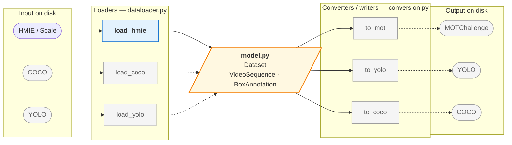
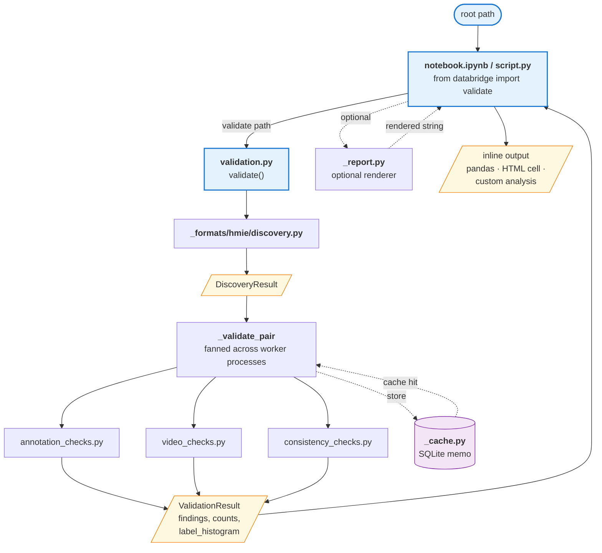
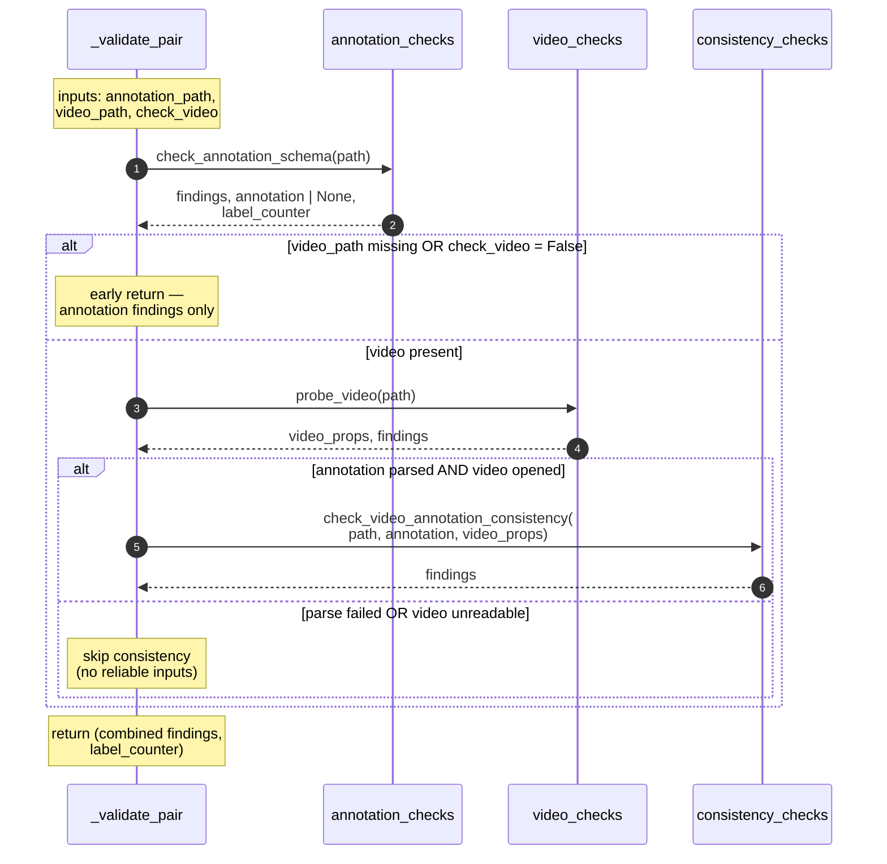
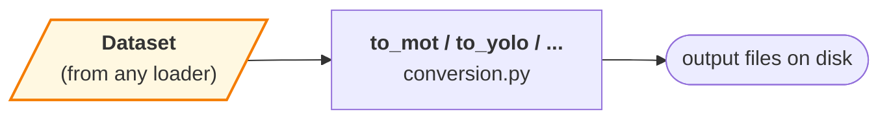

# Architecture

A reviewer's map of the codebase. Read this with the code open.

## What databridge does (today)

One pipeline: **walk a dataset root on disk → pair each annotation JSON
with its video → run checks on each pair → aggregate findings into a
`ValidationResult` → render a report**. The only format currently
implemented is HMIE (Scale Video Playback JSON + snippet folder layout).
Everything is structured so other formats can be added behind the same
public entrypoint without touching the CLI or reporting layers.

## The bridge — loaders × converters

The longer-term shape is an **N-to-M bridge**. A *loader* parses an
on-disk dataset into one neutral in-memory model (`model.py`); a
*converter / writer* serialises that same model back out to another
format. Because every loader produces the identical `Dataset` and every
converter consumes it, any input format can feed any output format —
adding a loader gains an input, adding a converter gains an output, and
neither side knows about the other. Solid = implemented today; dashed =
planned.



Today only the HMIE loader (`load_hmie`) and the validation pipeline are
implemented; the converters are not yet written. See
[Loading](#loading--dataloaderpy) for how `load_hmie` builds the model and
[Converters](#converters--conversionpy) for the writer contract.

## Project layout

```
src/databridge/
    __init__.py              Public API surface
    _cli.py                  CLI entrypoint (`databridge validate ...`)
    _types.py                Shared types: Finding, Severity, ValidationResult
    _cache.py                On-disk cache for expensive video probes
    _report.py               Text / JSON / JSONL / HTML report rendering
    _version.py              Package version
    model.py                 Neutral dataset model: Dataset, VideoSequence, BoxAnnotation
    loaders.py               Loader contract (ABC) + registry + load() dispatch
    validation.py            Orchestration: discovery -> checks -> aggregation
    dataloader.py            HmieLoader: the reference loader (on-disk HMIE -> Dataset)
    conversion.py            Converters/writers: Dataset model -> output format (placeholder)
    _formats/
        __init__.py          Format registry
        hmie/
            __init__.py              HMIE format entrypoint
            discovery.py             Filesystem walk (snippet-centric, seq_mp4 / seq_ts)
            schema.py                Pydantic models for Scale Video Playback JSON
            categories.py            Severity / category taxonomy for findings
            annotation_checks.py     Scale schema + semantic checks on JSONs
            video_checks.py          FMV open / decode / corruption checks
            consistency_checks.py    Annotation <-> video cross-references
docs/
    architecture.md                              This file
    schemas/
        scale-video-playback-v1.schema.json      JSON Schema for Scale format
tests/                       pytest suite (coverage gate 90%)
```

For the on-disk dataset layout that `discovery.py` walks, see the
["Dataset layout on disk" section in the README](../README.md#dataset-layout-on-disk).

## Reading order

The modules form a clean dependency stack. Read them bottom-up; each
layer depends only on layers below it.

1. `_types.py` — the vocabulary (`Finding`, `Severity`, `ValidationResult`, `DatasetFormat`)
2. `_formats/hmie/schema.py` — Pydantic models for the Scale annotation JSON
3. `_formats/hmie/discovery.py` — filesystem walk that produces `SnippetPair`s
4. `_formats/hmie/annotation_checks.py` — per-annotation checks (schema + semantic)
5. `_formats/hmie/video_checks.py` — per-video integrity probe (cv2)
6. `_formats/hmie/consistency_checks.py` — cross-checks between annotation and video
7. `_formats/hmie/categories.py` — maps check names to the 4 requirement categories
8. `_cache.py` — SQLite-backed memo of per-pair results keyed by file fingerprint
9. `validation.py` — orchestration: discovery + fan-out to workers + aggregation
10. `_report.py` — text / JSON / JSONL / HTML rendering of a `ValidationResult`
11. `_cli.py` — argparse wrapper around `validate()` and the renderers

## Data flow CLI


## Data flow notebook

Skipping the CLI — a notebook or script imports `validate` directly,
gets a `ValidationResult` back, and either inspects it in code
(pandas, custom analysis) or passes it to `_report.py` for a rendered
view inside a cell.




## Discovery — how pairs are built

`discovery.py` runs in two phases: a single `os.walk` that *classifies*
every directory it meets (snippet? seq_*? annotation parent? metadata
to skip?), then a pairing pass that matches annotations to videos via
their shared snippet directory. The layout varies between dataset
families (`scale/` vs a labeler subfolder, `seq_mp4/` vs `seq_ts/`,
`mapp_metadata/` vs `0601_metadata/`), so every decision below is a
branch in the real code.


Key invariants worth remembering while reading `discovery.py`:

- A "snippet dir" is defined by the *presence of a `seq_*/` child*, not
  by name — this is what makes the walker tolerate the family-specific
  layout differences.
- Snippet-level JSONs (right next to `seq_mp4/`) are never annotations —
  they are video metadata. Annotations always live one level deeper, in
  a subdirectory like `scale/` or a labeler folder. The `parent.parent`
  indexing in Phase 2 relies on this.
- A snippet with videos but no annotation subdir is *not* an error here
  — it just produces no pairs. Whether that's acceptable for the
  dataset is a decision made later, in `validation.py`'s coverage check.
- **Batch-level `scale/` merges with the snippet-centric pass** (it is not
  an all-or-nothing fallback). Any `scale/` directory that is *not* inside a
  snippet — i.e. a batch-level `scale/` holding annotations for sibling
  snippets — is discovered per batch directory and its pairs are *added* to
  the per-snippet pairs. So a parent of several batches each with their own
  `scale/`, and trees that mix per-snippet and batch-level annotations, are
  both fully discovered. Each annotation is paired to a video *within its
  batch* by the filename embedded in the Scale annotation name
  (`match_annotation_to_video`, also reused by the loader's override mode);
  that matcher returns ambiguous (orphan) rather than guessing when two
  videos share a basename, and non-annotation JSON (e.g. `metadata.json`) in
  a `scale/` dir is skipped. Batch-level pairs carry the matched video's
  `snippet_dir` so `validation.py`'s `snippet_count` stays correct.


## Inside one pair's validation

The top-level diagrams hide the guards inside `_validate_pair`. This
sequence shows what actually happens for a single `(annotation, video)`
pair — note the early exits and the fact that the parsed annotation
is *reused* (not re-parsed) by the consistency check.



The consistency step runs even if `video_checks` emitted ERROR findings
(e.g. a bad middle frame), as long as `video_props.opened` is true —
fps / frame_count / dimensions are still authoritative in that case,
and gating would silently hide real annotation-vs-video mismatches.

## Loader architecture — `loaders.py`

The input side of the bridge is a small, explicit contract so that every
format loader looks the same and a new format is additive. Three pieces:

```mermaid
flowchart TD
    LOAD["<b>load(root, dataset_format=…)</b><br/>public dispatch"]
    REG[("<b>registry</b><br/>DatasetFormat → Loader")]
    BASE["<b>Loader (ABC)</b><br/>load(root, **options) → Dataset<br/>sniff(root) → bool"]
    HMIE["<b>HmieLoader</b><br/>(dataloader.py)"]
    NEW["CocoLoader, YoloLoader, …<br/>(future)"]

    LOAD -->|get_loader| REG
    REG --> HMIE
    REG -.-> NEW
    HMIE -->|subclasses| BASE
    NEW -.->|subclasses| BASE
    HMIE -->|@register_loader| REG
    NEW -.->|@register_loader| REG

    classDef entry fill:#e3f2fd,stroke:#1976d2,stroke-width:2px;
    classDef store fill:#f3e5f5,stroke:#7b1fa2;
    classDef impl fill:#e8f5e9,stroke:#2e7d32;
    classDef planned fill:#f5f5f5,stroke:#9e9e9e,color:#616161;
    class LOAD entry;
    class REG store;
    class HMIE impl;
    class NEW planned;
```

- **`Loader` (ABC).** The contract: a concrete loader sets a `format`
  (`DatasetFormat`) class attribute and implements
  `load(self, root, **options) -> Dataset`. An optional `sniff(root) -> bool`
  classmethod is the autodetection hook (default `False`).
- **`register_loader`.** A decorator that records `format → loader-class` in
  the registry. This is the extension point — adding a loader does not touch
  any dispatch code.
- **`load(root, *, dataset_format=…, **options)`.** The public entry point.
  Resolves the loader from the registry and calls it. `dataset_format` accepts
  a `DatasetFormat` or its string value; pass `None` to autodetect via
  `sniff` (no format implements detection rules yet, so an explicit format is
  required in practice). `**options` pass through to the loader (e.g. HMIE's
  `require_video`). `load_hmie(...)` remains as a thin convenience wrapper.

This mirrors the validator: `validate(path, dataset_format=…)` dispatches the
same way. Loaders and validators are siblings — both are thin, format-specific
consumers of the `_formats/<format>/` layer.

### Loader conventions

Every loader honors the same contract so callers and converters can rely on it:

- **Return, don't raise, on bad data.** Loading is best-effort: an item that
  cannot be parsed is skipped and logged at WARNING; the loader returns a
  (possibly empty) `Dataset`. The authoritative "*why* is it bad" answer is a
  separate pass — `validate()`.
- **Keyword-only options, consistent names.** Loader-specific options are
  keyword-only; shared semantics (e.g. `require_video` for any FMV format)
  keep the same name and meaning across loaders.
- **One model out.** Every loader produces the same `Dataset`, so any
  converter consumes the result regardless of input format.

### Common data model (images vs. FMV)

The neutral model (`model.py`) is the agreed common representation, and the
`Loader` contract is intentionally model-shaped, not format-shaped. Today the
model is FMV-centric: a `Dataset` holds `VideoSequence`s of `BoxAnnotation`s.
**Image datasets** (COCO, image-mode YOLO) will be represented by an
`ImageSample` sibling of `VideoSequence` carrying the same `BoxAnnotation`,
added together with the first image loader — at which point `Dataset` holds a
mix of sequence and image samples. The `Loader.load() -> Dataset` contract does
not change when that lands, which is the whole point of fixing the contract
now. (We deliberately do not define `ImageSample` ahead of a loader that
produces it, to avoid a consumer-less abstraction we'd likely get wrong.)

### Adding a new loader

To support a new input format `foo`:

1. Add `FOO = "foo"` to `DatasetFormat` (`_types.py`).
2. Create `_formats/foo/` with that format's discovery + schema/parse helpers
   (mirrors `_formats/hmie/`), keeping format specifics isolated.
3. Write a `FooLoader(Loader)` with `format = DatasetFormat.FOO` and a `load`
   that returns a `Dataset`, following the conventions above. Decorate it with
   `@register_loader`. (Use `HmieLoader` in `dataloader.py` as the template.)
4. Ensure the module is imported so registration runs (export it from the
   package `__init__`).
5. Optionally add format-specific validation under `_formats/foo/` and a
   `DatasetFormat.FOO` branch in `validation.py`.

`databridge.load(root, dataset_format="foo")` then works with no changes to
the dispatcher, and any existing converter accepts the result.

## Loading — `dataloader.py`

`load_hmie(root)` (and the `HmieLoader` behind it) is the other consumer of
the discovery + schema layers.
Where `validate()` runs *checks* on each pair, the loader *parses* each
pair into the neutral in-memory model defined in `model.py`:

```
discover_hmie_pairs(root) ─► [SnippetPair]
                                  │  (per pair)
                                  ▼
              check_annotation_schema(path) ─► ScaleAnnotation
                                  │
                                  ▼
        VideoSequence(boxes=[BoxAnnotation, ...], video_meta, fps, ...)
                                  │
                                  ▼
        Dataset(sequences=[...], categories={uri: id})
```

`Dataset` / `VideoSequence` / `BoxAnnotation` live in `model.py`, not in
`dataloader.py`, on purpose: the model is the **format-neutral hub** of the
bridge. `load_hmie` is one loader that produces it; future loaders (COCO,
YOLO, ...) produce the same `Dataset`, and converters consume `Dataset`
without depending on any loader. That is what makes databridge an N-to-M
bridge (loaders × converters) rather than an HMIE-to-X path.

Design points:

- **Reuses, never re-walks.** Pairing comes from `discovery.py` and
  parsing from `annotation_checks.check_annotation_schema` — the same
  robust paths the validator uses (unwrapped-format handling, duplicate
  keys, size limits). It does not reimplement the notebook's
  `rglob("*CDAO*.json")` / `seq_mp4` assumptions.
- **Loading ≠ validating.** Best-effort by design: an unparseable
  annotation is skipped (logged), and a box with any missing
  coordinate is dropped. Callers wanting *why* data is bad run
  `validate()`.
- **Dataset-wide category map.** `category_id`s are assigned once across
  the whole dataset, so a label maps to the same id in every sequence.
- **`require_video`.** Default loading never opens videos
  (`num_frames` comes from the max annotated frame index, core deps
  only). `require_video=True` probes each video via `video_checks`
  (the `video` extra), takes `num_frames` from the true frame count,
  and skips snippets whose video is missing or unreadable.
- **Override mode.** Passing `annotation_dir` / `video_dir` bypasses
  discovery for flat (non-nested) layouts, pairing by matching a
  video's stem against the annotation filename.

## Converters — `conversion.py`

The writer half of the bridge (the writer side of the original notebook)
is not yet implemented. A converter is the mirror of a loader: it takes a
`Dataset` and writes an output format to disk.



The contract is what keeps the bridge N-to-M:

- **Converters bind to `Dataset`, never to a loader.** Nothing in
  `conversion.py` imports `dataloader.py`; a converter only sees the
  neutral model, so the same `to_mot` works whether the data came from
  `load_hmie`, `load_coco`, or any future loader.
- **Frame indices are already video-frame-space.** `BoxAnnotation.frame_index`
  is mapped (not the raw label key), so frame-indexed targets like
  MOTChallenge map straight across without re-deriving the clock.
- **Tracks and stable category ids are already in the model**
  (`track_id`, dataset-wide `category_id`), which the track-centric (MOT)
  and class-indexed (YOLO) formats need.
